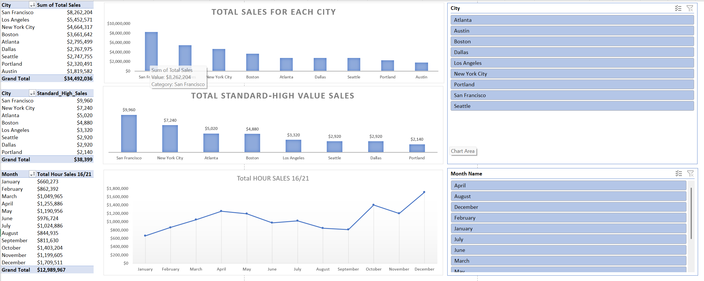

# E-Commerce-Sales-Analysis
End-to-end data analysis of 185,000+ e-commerce sales records. Built an interactive dashboard using Excel, Power Query (ETL), Power Pivot, and DAX to uncover top-performing cities and peak evening sales trends.

# E-Commerce Sales Analysis

End-to-end data analysis of 185,000+ e-commerce sales records. Built an interactive dashboard using Excel, Power Query (ETL), Power Pivot, and DAX to uncover top-performing cities and peak evening sales trends.

## 1. Overview
**Data Source:** The raw dataset (12 files) was provided by Keith Galli, representing monthly sales records.

So in this project, I engineered and analyzed a dataset of over 185,000+ rows of raw e-commerce sales data. My goal was to transform messy, unorganized data into a dynamic, business-driven dashboard that answers strategic questions regarding city performance, product tiers, and optimal advertising times during peak evening hours.

## 2. Tools & Technologies Used
* **Excel Power Query (ETL):** Extracted, cleaned, and shaped the raw data.
* **Power Pivot (Data Modeling):** Built the underlying data model to handle large datasets efficiently without crashing Excel.
* **DAX (Data Analysis Expressions):** Programmed complex measures using `CALCULATE` to filter sales dynamically based on multiple criteria.
* **Data Visualization:** Designed a clean, executive-level dashboard focusing on high data-ink ratios and clear storytelling.

## 3. Key Business Insights
* **Top Performing Market:** in San Francisco leads the total sales by a massive margin, exceeding $8.2 Million.
* **High-Value Budget Shoppers:** Identified a specific segment of customers buying "Standard" products in bulk, generating over $38,000 in unexpected high-value orders. And also San Francisco taking the lead here for over $9.900
* **Advertising Strategy (Peak Hours):** Evening sales (4 PM - 9 PM) peak significantly during December ($1.7M) and October ($1.4M), indicating the optimal months to increase ad spend, while September shows a sharp drop, requiring a revised strategy.
## 📂 Repository Structure
* `Raw_Data/`: Contains the 12 original, uncleaned CSV files.
* `E-Commerce_Sales_Dashboard.xlsx`: The final interactive Excel file (contains Power Query, Data Model, and Dashboard).
* `Dashboard_View.png`: A quick snapshot of the final dashboard.

## 📊 Final Dashboard Preview

